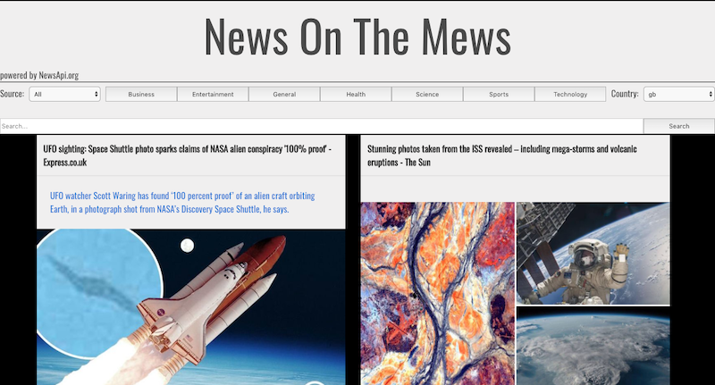

# SEI Project 2: News On The Mews


Update: Click [here](https://github.com/GRudinsky/sei-project-2) for refactored version of the same app with separate UI components and React Hooks.
---

## Overview 

News On The Mews is an online web application that displays news headlines on different topics and in different languages from all over the world.
It was built together with [mElbo-dk](https://github.com/mElbo-dk) over a 2 day period pair-programming hackathon and was the second project during my course at General Assembly.



---
## Technologies Used

* HTML5
* CSS3 and Bulma CSS framework
* JavaScript
* React
* Axios
* Public [NewsAPI](https://newsapi.org/)
* Git/GitHub

---
## Deployment

Web version can be found on [Heroku](https://newsonthemews.herokuapp.com/)

---
## Getting Started

Clone the repository and run on your machine. 

Install the packages listed in the package.json file by running the following terminal command:
```
$ npm i
```
Run the app on your localhost 8000 with the following command:
```
$ npm run serve
```
In order tpo get the content you will need to obtain the API key from [NewsAPI](https://newsapi.org/). Once obtained, create .env file in the project root directory and paste in your key in the following text 
```
WEBAPI_ACCESS_TOKEN = 'your_API_key_here'

```
---
## Usage

Page loads with general UK News. From there user has below choices:
* Pick news from the different category by clicking on the dedicated category button.
* Search for any keyword-related news in the search-bar.
* Search for news by country and in language selected from the "Country" selector.
* Filter any of the above news content by the news sources from the "Sources" selector.
* Once clicked on one of the generated contents card, user gets navigated to the original source page to read the full article.

---
## Approach Taken

For both myself and [mElbo-dk](https://github.com/mElbo-dk) it was first pair programming experience. We were switching roles in being the navigator and the driver - by utilising this method, we were able to collaborate and learn from each other.

The initial challenge we had was to pick the theme for the app that would later lead to the choice of an API for it. Once we chose the news topic and signed up for News API token, we dived into documentation to research the possible search end-points. This led to us being able to draw the possible search criterias and features. We decided to to make an GET request to get the "general" category news on page content load and display the buttons for other possible categories that API documentation allows. Another features that we deciced to iplement were the "search-bar" and language selector, which leads to display news results in different languages. For all above described steps we decided to implement the additional news sources filter bar that allows the user to filter them by the sources relative to the user choice. 

Below is the algorithm that performs the news GEt and filter source features.

```
getData(selectedCountry, selectedCategory) {
    // console.log('filter state', this.state.filteredSources)
    axios.get(`https://newsapi.org/v2/top-headlines?country=${selectedCountry}&category=${selectedCategory}&apikey=${process.env.WEBAPI_ACCESS_TOKEN}`)
      .then(res => {
        this.setState({ news: res.data, filteredArticles: res.data.articles }, this.retrieveSources )
      })
      .catch(err => console.log(err.message))
  }

  retrieveSources() {
    const filteredSources = [...new Set(this.state.news.articles.map(article => (article.source.name)))] || this.selectedSource === 'All'
    this.setState({ filteredSources })
  }

  filterArticles(e) {
    const selectedSource = e.target.value
    this.setState({ filteredArticles: (selectedSource !== 'All' ? this.state.news.articles.filter(article => article.source.name === selectedSource) : this.state.news.articles) })
  }
```

---
## Wins

This the first pair-programming and first React project for me and my colleague. It gave us an invaluable experience and something to build onto future coding projects.

---
## Future Improvements

* Make the page more mobile-responsive.
* Store users last country and news type selection in localStorage so that more user-relevant content could be generated on the page load.
* Translate page navigational content to relevant language after user changes to sources from different country in the Country selector.

---
Update: Click [here](https://github.com/GRudinsky/sei-project-2) for refactored version of the same app with separate UI components and React Hooks.
---


